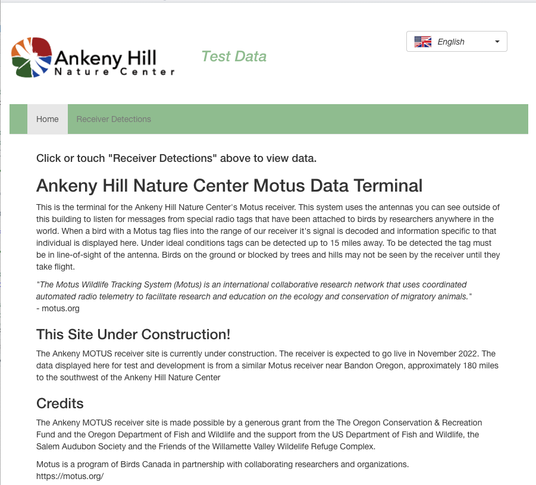
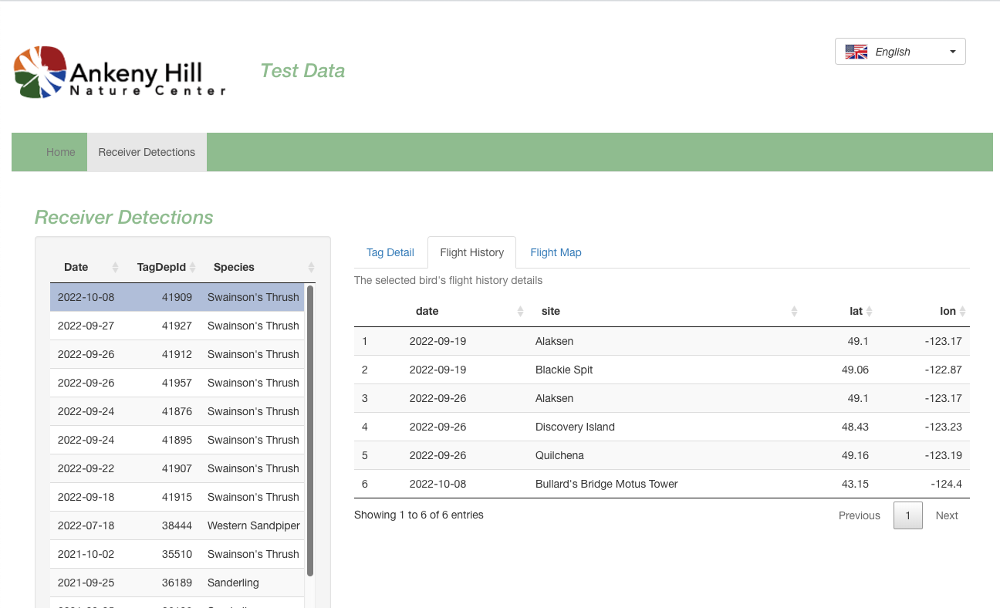

# AHNC_MOTUS_KIOSK
## Ankeny Hill Nature Center MOTUS Kiosk System

This project creates a public display or "kiosk"" for a Motus receiver station for the US Fish and Wildlife Service (USFWS) Ankeny Hill Nature Center.  The goal is to engage public visitors to the site with a simple near-realtime display of migratory bird tag detection events. It presents a very simple limited number of screens that are easy to navigate via a touchscreen display.

The Motus Wildlife Tracking System (Motus) is an international collaborative research network that uses coordinated automated radio telemetry to facilitate research and education on the ecology and conservation of migratory animals. Motus is a program of Birds Canada in partnership with collaborating researchers and organizations. Learn more at https://motus.org

*Figure 1 - Kiosk homepage*

*Figure 2 - The Kiosk Receiver Detections tab panel*

###  Acknowledgements and Restrictions on Data Use or Publication

***Any use or publication of the data presented through this application must***
***conform to the terms of the Motus Collaboration Policy*** at https://motus.org/policy/
and ensure proper recognition of Motus, Birds Canada, Motus researchers and projects.
You should have received a copy of the Motus Collaboration Policy document in this
projects home directory when you downloaded the source code. Look for the file
or find it at https://motus.org/policy/

### Contributors

* Richard Schramm,  original author

### Who can I talk to about it? ###

* Richard Schramm - schramm.r@gmail.com

### Copyright and License

Copyright 2022 Richard Schramm - Corvallis, Oregon USA

This program is free software: you can redistribute it and/or modify
it under the terms of the GNU General Public License as published by
the Free Software Foundation, either version 3 of the License, or
(at your option) any later version.

This program is distributed in the hope that it will be useful,
but WITHOUT ANY WARRANTY; without even the implied warranty of
MERCHANTABILITY or FITNESS FOR A PARTICULAR PURPOSE.  See the
GNU General Public License for more details.

You should have received a copy of the GNU General Public License
along with this program source code when you obtained the software.

Please read the included LICENSE file and/or see <http://www.gnu.org/licenses/>.

### Hardware & Software Requirements

I have quite successfully run on low-end  Intel NUC PC computers with Window 10 Pro pre-installed. These are easily purchased used on eBay for as little as $100. 

NUC6CAY Celeron J3455 Processor 1.5Ghz 8GB Ram 120GB SSD w/wifi and Windows10 Pro (eBay $100)

NUC7i5BNH MiniPC QUadCore i5-78260U 8Gb w/128Gb SSD w/wifi and  Windows 10 Pro. (eBay $185)

As an experiment: CHUWI Larkbox PRO miniPC 6GbRam QuadCore 2.7Ghz Celeron J4125 with wifi and Windows 10 (Home Ed) $139 Amazon --not recommended due to reliablity concerns, but its cute!)

The touchscreen: Dell 24 Touchscreen Model P2418HT (Dell.com $350)

USB Keyboard and Mouse

I *strongly* recommend Windows-10 PRO edition.  Home Edition works too but with some headaches.

### Where to Start?

See **WINDOWS_FIRSTRUN_README.md** in the project's top level directory. 

Alternately, if you want to skip all of the Windows and kiosk-specific setup and just play with the app in R, see BUILDING_THE_APP_README.md

