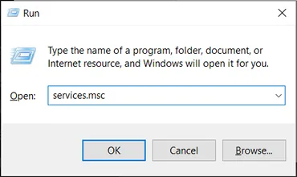
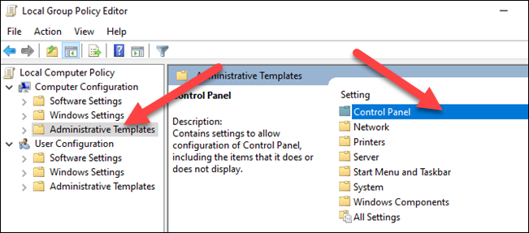
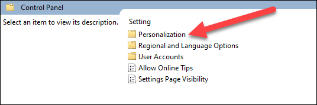
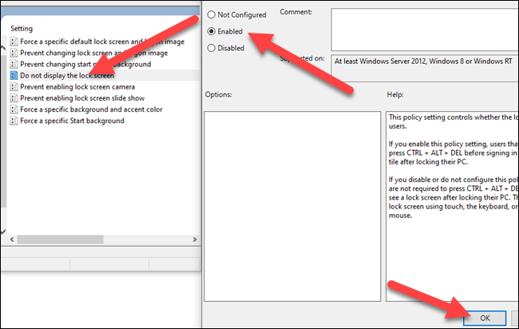
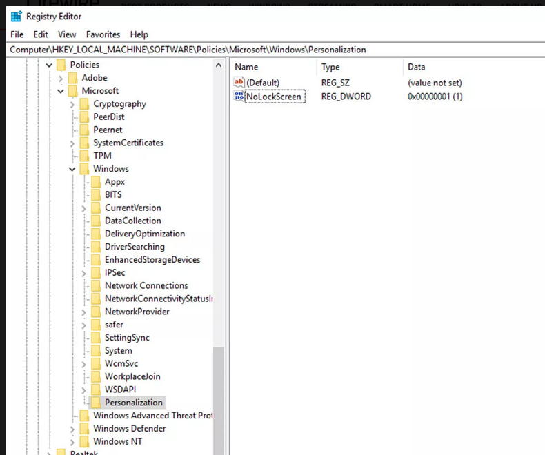

# Ankeny Kiosk WindowsFirstRun


### Ankeny Hill Nature Center WindowsFirstRun ###
This document is a guide on how to get the Windows computer set-up to host the the 'Motus Kiosk'   It is one of the three documents that I use to describe the full setup of the kiosk.

The first is this document: WINDOWS_FIRSTRUN_README.md that describes bringing up a brand new Windows 10 machine from scratch. It includes all the tweaks and settings to MS Windows 10 operating system as well as the correct MOTUS_KIOSK user account settings.  It assumes you just received a new computer with a freshly installed Windows 10 operating system. 

The second doc is BUILDING_THE_APP_README.md that describes installation of the build tools and constructing the Shiny web app from source code.

The third document is FINAL_DEPLOYMENT_WINDOWS.md  that describes how to deploy the web app once you have it working.

If you are wanting to modify or further develop the application there is a fouth document named DEVELOPERS_README.md that may be helpful to understanding some of the system structure.

There are quite a number of steps and tweaks to Windows 10 and the user accounts settings required to get the full, securely locked-down kiosk behavior we ultimately require.

This doc also includes some steps that 'technically unnecessary' but deal with my personal pet peaves regarding clutter and bloat that make me dislike MS Windows.  I will try and alert you to those as "Optional"

If you are well experienced in Windows system administration it may be more tedious and verbose than you need.  If you are a novice, hopefully it will be detailed enough to get you through and on to the fun parts.

Also - if you are jumping in from a computer that has already been 'spun up' or if you like to skip ahead but be advised, you may get away with skipping some steps but you will likely need to come back here to get everything set just as it should be.


### Who do I talk to? ###

* Owner/Originator:  Richard Schramm - schramm.r@gmail.com

### Preliminaries ###

Unfortunately Microsoft supplies 'Windows 10' in different configurations - Windows 10-Pro is recommended though you may have received 'Home Edition'. Or you may have ended uop with Windows-11 (I hope not...)

There are variations within released versions and even customizations - so called 'Experience pacakages' within version.  So it is impossible to write detailed instruction that are accurate across all variations.

Strongly advised is Windows 10-Pro and that is what this document assumes.  Hopefully where we differ you can use what I provide and some hunting-around to get to the correct settings.

We will be setting up two accounts, one user with administrator permissions and one unprivileged user that the kiosk will run under.  The unprivileged account will be auto-login *with no password*. 

You should be prepared to provide the following information:

* a good username and password for the administrator account.  I will use username = Admin
* the kiosk unprivledged user account I will use is MOTUS_KIOSK. If you choose to use a different username and just pay close attention to where this and the companion documentation differs.

### How do I get started? ###

#### Main 1.0 - New Computer w/Windows 10 - First Boot

***You may skip this section if you already have a computer you can log in as the administrator.***

If you aquired this computer as new - the first boot will take you through creating the first administrator account. If you received a preowned computer it will likely already have an administrator account and boot directly in to it. Typically the account is named something like "User"

Here we assume a brand new computer with Windows pre-installed.

Below is the approximate sequence I saw and followed on first boot of my Intel NUC computer with MS Windows 10

1. Power on, let the boot start…  *I didn't do F10 key or anything at the bios ‘select boot’ screen*
2. After about 2 minutes while it was looking dead,  it should finally start to boot, it may say restarting etc, then it eventually goes back to ‘select boot’, bios screen and then proceeds to start the boot to windows. Be patient...
3. It may go straight into ‘working on updates’ blue screen.  It takes awhile,  Says “94% complete” fairly quickly, then still took a while to get to 100%. ( I don’t know where it thinks its getting updates from…. its likely not on the network yet, - just let it go)
4. Eventually you will get some kind of  “User ‘Welcome" message
5. You may get a whole series of questions from the 'Cortana' assistant - if you do:
   1. If you get asked to create a user - create a user named "Admin" and provide some security answers if you are forced to (I dont like these and will disable them further down in this guide.
   2. When Cortana gets to "Choose privacy settings" turn the all 'Off'
   3. When Cortana asks "Let Cortana help you" Choose "Not Now"

6. Eventually get auto logged - it may ask you to brows ewith 'Microsoft Edge' - choose "Maybe Later"
7. Click the lower-left corner ‘Start Window’ icon:  
    Hover over the logged-in person icon - it should show the user you are logged in as -  it and then pick ‘Change account settings’  *Verify It says you are a local account and an Administrator*

#### Main 2.0 - First Connection to Wireless Network

I am using wifi to connect to the internet. *If you already auto connect to network on your computer you may skip this step.*

1. In the search box , lower-right corner type Settings.
2. Select the 'Settings App'  and open it.
3. Choose to 'Network&Internet'  > 'Status'
4. Note status is Not Connected
5. On status page, just above where is says “Advanced Network settings” - click "Show available networks"
6. A Pop-up shows all available network names, choose your WiFi system 
7. Check "Connect Automatically" (if shown) and click  "Connect" 
8. Log into your network (and set ‘login to this network automatically’ if itis shown here)Set

#### Main 3.0 - Rename computer (optional)

1. Start>Settings>System>About
2. Use Rename this PC to change the name to anything you like.  I used AHNC-MOTUS1

#### Main 4.0 - Change group password policy to disable the “password security questions” 

I dont like to expose this password discovery mechanism on a computer that may have shared users. (Personal info may be discoverable).*Disabling the feature  is optional.*  While logged in as an administrator - We will edit an existing group policy using "gpedit" 


If you have Windows 10 Home Edition - gpedit may be missing... paste  the two 'For' commands  below into a Cmd.exe window as Administrator/.   Othewise skip this step.....

```
To install the Local Group Policy Editor in Windows 10 Home edition, open a command prompt as administrator and run two one-line commands in sequence:

FOR %F IN ("%SystemRoot%\servicing\Packages\Microsoft-Windows-GroupPolicy-ClientTools-Package~*.mum") DO (DISM /Online /NoRestart /Add-Package:"%F")

FOR %F IN ("%SystemRoot%\servicing\Packages\Microsoft-Windows-GroupPolicy-ClientExtensions-Package~*.mum") DO (DISM /Online /NoRestart /Add-Package:"%F")

then type gpedit in Cmd.exe

```

see also: https://answers.microsoft.com/en-us/windows/forum/all/how-to-enable-the-gpeditmsc-on-windows-10-and-11/dbc76919-f2b5-4dec-a2b7-bcf545c34d00


1. Open the Start menu in desktop lower-left and Search for gpedit and run it (note it may say "Edit Group Policy" instead of gpedit). 

2. Browse the following path: Computer Configuration > Administrative Templates > Windows Components > Credential User Interface.

3. On the right side, double-click the "Prevent the use of security questions for local accounts" policy.

4. Select the “Enabled” radio button. (you are ‘enabling’ the prevention policy)

5. Select 'Apply' then ‘OK’

6. Admin

   


#### Main 5.0 - Remove “Microsoft OneDrive”  (Optional)

ControlPanel>Programs&Features  Select One-Drive , Rightclick and choose UnistallProgram

#### Main 6.0 - Customize Microsoft Edge (Optional)

The first time you run Microsoft's default Edge browser it may go through several windows that attempt to sign you up for a bunch of services and features we do not need or want.  Go ahead and open Edge and be careful on those first few screens.  It is completely ok to select No Thanks to everything and to 'Proceed without this data' etc.

#### Main 7.0 - Install Google Chrome

Before starting please read and note the following

- ***if asked - do not ‘sign-in’ to google, setup any apps (mail etc)***

- ***if asked - do not turn on ‘Sync’, do not ’Import Settings’ or ‘Bookmarks’***

- **if asked deselect any add-ins, tracking and bloat-ware that google offers**.

- Use the Microsoft's "Edge" browser to find, download and install Chrome (run the downloaded setup.exe).

- Exit Edge when done 

- Open Chrome by double-clicking the desktop icon, ***then set it as the default browser***.


#### Main 8.0 - Install Firefox Browser

Use Chrome to install Firefox. – again, ***no sign-in, no extra features etc.***

Firefox may put the installer in your 'Downloads' folder , use the explorer to run it from there 

#### Main 9.0 - Turn off auto-updates

I like to control when updates happen manually - so I can backup and roll-back if something breaks

 Follow instructions in Appendix 2

#### Main 10.0 - Disable the windows “Lock Screen” 

(See Appendix 3. Disable Lock Screen)

#### Main 11.0 - Create a local “Admin” account with password

 Create a local administrator account named “Admin” (*w/no “Microsoft Account Login*” !!!)

There are two workflows (at least) depending on which exact Windows10 versionyou have,  to get you to the create account panel… either:

* ControlPanel > Settings > Family&OtherUsers ...or… 
* ControlPanel > UserAccounts > UserAccounts > ManageAnotherAccount >  Add a new user in PC settings”

Below the list of existing users, click link to "Add someone else to this PC"

This should pop-up a “Microsoft account” dialogue window,

* Select “I don’t have this persons sign in info” Then pick “I DON’T HAVE” , then in the “Create account” window, pick “Add user without a Microsoft Account”, should take you to “Create a user for this PC” window

* Set the user name to “Admin” and add a robust password.

* Click apply. You should now see the "Admin" user under “Other Users” as a “Local account” – click on it to select, then click “Change account type” and set it to be an Administrator and click OK.

* Verify the Admin account now shows up in the users list as “Local Administrator”

Log out completely, then log back in as “Admin” and let it go through the 'new user setup' screens.  On the ‘Choose privacy settings’ screen – set all of the optional settings to NO, and then press Accept.

Do a complete shutdown/reboot and verify you can log in again as "Admin" and return to the UserAcconts in via the ControlPanel and verify you are still a "Local Administrator"

#### Main 12.0 - Cleanup the Admin account desktop

Follow  "Appendix 1. Common Cleanup" 

#### Main 13.0 - Create a backup administrator account with password

I strongly recommend adding a second Admin account in case you somehow damage the User=Admin account.  (*Later we will disable any "User" admin account that has no passwords and is a security risk*)

Create and cleanup this backup administrator account of any name you choose just as you did above.

#### Main 14.0 - Add MOTUS_KIOSK user with Auto-login

Now we add the account that the kiosk will run under.  The two main diferences from above administrator accounts are:

* this user will not have any password (we want it to auto-login)
* this user will not have administrator  privledges

While logged in as an administator:

**14.1** Similar to previous section wheer we created the Admin account - use the ControlPanel to navigate to:

ControlPanell>UserAccounts>ManageAnotherAccount>AddNewUserInPCSettings>AddSomeoneElse

This should pop-up “Microsoft account” panel, pick “ I don’t have this persons sign in info”

Then pick “I DON’T HAVE” , then in “Create account” window, pick “Add user without a Microsoft Account”. 

Enter username MOTUS_KIOSK and **do not enter any passwords**, click next

*** It should return the “Family&Other Users” window and MOTUS_KIOSK should now appear in the list as a ''Local account'*. 

**14.2** Log out as Administrator and then do your first login as MOTUS_KIOSK - it will take a while….

Eventually it will pop-up the “Choose privacy settings” page. Deselect all of the Microsoft offered goodies on this page then click ‘Accept’. 

**14.3** Then log off and restart windows.. 

 **14.4** **Verify >>** since MOTUS_KIOSK was last logged in user and has no password, it should auto-login on reboot. If not, select MOTUS_KIOSK as user and click ‘Sign In’ button to log in manually. Then repeat the reboot and auto-login sequence

**14.5** stay logged in as MOTUS_KIOSK.  Let the computer sit idle for whatever your screensaver timeout has been set to.  **Verify**>> Screensaver fires correctly and when you return to move the mouse you are fully logged in (NO lock screen to go through)

####  Main 15.0 -  Perform cleanup for User=MOTUS_KIOSK all as before 

It is important that user MOTUS_KIOSK have properly configured screen saver timeouts and notification setting as we want the Kiosk to manage itself unattended.

As user=MOTUS_KIOSK clean up desktop, set screen saver correctly, turn off notifications etc I recommend you follow  "Appendix 1. Common Cleanup"  completely.

***As a minimum you should perform step in Appendix 1 Sections 1.5 and 1.7 for MOTUS_KIOSK***

#### Main 16.0 - Install SSH (Optional)

SSH is a useful facility that allows you to remotely login to your WIndows computer or to easily copy files to or from another computer.  It is commonly installed by administrators to facilitate their access and provide support.  If you want to be able to use it - follow the setup in Appendix 4.

#### Main 17.0 - Set power and display shutdown 

Log in as Admin and using ControlPanel app

**17.1.** Hardware&Sound>PowerOptions>ChooseWhenToTurnOffDisplay = never

**17.2.** Hardware&Sound>PowerOptions>ChooseWhenToSleepComputer = never 

#### Main 18.0 - Remove any unprotected  administrator accounts

If you have any administrator accounts with no password it is a security risk. Some computers purchased used may have an account name something like "User" that you used at first boot.

WARNING - DO NOT DELETE ANY ADMININSTRATOR ACCOUNT UNLESS YOU HAVE ANOTHER ACCOUNT TO LOG IN AS ADMINISTRATOR 

Completely shut down and restart your computer, make sure you can log in as user=Admin and it is a local administrator.

Use the ControlPanel to navigate to:

User Accounts > User Accounts > Manage Another Account 

Choose the account "User"


Then choose either 'Create Password' or 'Delete the account'

####  Congratulations - You have completed Windows FirstRun setup. Proceed to the second doc - BUILDING_THE_APP_README.md


## Appendix 1 – Common Cleanup for new user account

***All of these steps are optional.***  I recommend cleaning off all of the mostly distracting and useless bloat that Microsoft puts on user toolbars and Desktop.  I also put shortcut to commonly need applications onto the taskbar and Start menu so I dont have to search for them.  

#### A1.1. Pin commonly needed tasks to Startup menu and/or Taskbar

 In searchbox at lower left of screen, type following app names, when they pop up, select ‘Pin to’ for taskbar and start window….)

 \- TaskManager

\- TaskScheduler 

\- Cmd.exe

\- ControlPanel

\- Settings

\- Chrome

\- Firefox

\- RegEdit (*only for Administrator accounts*)

#### A1.2.   Cleanup the Desktop

 Delete desktop shortcut to ‘Microsoft Edge’ (right-click and delete)

Un-pin Edge Icon from taskbar (right-click and un-pin)

If visiible - delete Cortana Icon from taskbar (right-click and uncheck 'Show Cortana Button'

#### A1.3.   Cleanup the ‘Start Window’

 Click the lower-left corner ‘Start Window’ icon to raise the "Start Panel":  


Un-pin all the bloat-ware from the Start Window by right-clicking each one and selecting ‘Unpin from start’ for each (if present):

\-    Disney

\-    We speak Gmail (or Mail)

\-    Microsoft Edge

\-    Microsoft Store

\-    Microsoft ToDo lists

\-    Photos

\-    Microsoft News

\-    Movies&TV

\-    Spotify

\-    PhoneLink

\-    Solitare

\-    Play (the whole folder)Window

#### A1.4.   Cleanup the ‘Taskbar’

Get rid of fthe following bloat icons for weather, mail, etc from taskbar.. 

 right-click in a blank area of toolbar

-turn off ‘show cortina’, ( make it unchecked)

-turn off ‘show task view’,

-hover over ‘news and interest’, on the pop-out submenu select 'Turn off' (make it checked)

-hover over ’Search', on the pop-out submenu, if 'show search highlights' is there as an option, turn it off (unchecked)

On the TaskBar at lower-right, hover over ‘meet now’ camera icon, r-click and select ‘hide’

\- Right click MicrosoftEdge icon on taskbar and select unpin from taskbar

\- Right click MicrosoftStore on taskbar and select unpin from taskbar

\- Right click Mail the (envelope) on taskbar and select unpin from taskbar

\- Hide the ‘MeetNow’ icon in taskbar if present 

​	a.   navigate to **Settings** → **Personalization** → **Taskbar** (using the right-sidebar)

​	b.   In the text 'Notification area' section click on the hypertext option **"Turn system icons on or off"  **

​	c.   Locate the **Meet Now** and toggle setting to the off position. 

 

#### A1.5. Turn off notifications.

Select Start , then select Settings .

b.   Select System > Notifications & Actions.

c.   *Definitely turn all the notifications off for the MOTUS_KIOSK user* (we do not want to see unexpected popups on our kiosk.  

I personally prefer to turn off notifications off for all user accounts… I find they are annoying

d.  Regardless of your choice to keep or turn off - I recommend  turn off at least:

​	"Show me the Windows welcome experience"

​	"Suggest ways to finish.."

​	" Get tips and tricks"

#### A1.6. Misc. Privacy Settings 

 Select Start, then select Settings

In Settings > Privacy > General.  Turn off the following options:

* Let windows track app launches

* Show me suggested content in the Settings App

#### A1.7. Screensaver Settings

 Select Start, then select Settings

In Settings >  Personalization > Background

* From Background dropdown select "Picture"

* Below that, Select the background image you want - I use the plain Windows10 Blue

In Settings >  Personalization > Lockscreen

* Lockscreen choices should be grey’d out if you disabled lock screen earlier - *if not go do that now*

* If there is an option or checkbox labeled ‘**Get fun facts**’ set it to Off (unchecked) 

* set ‘**show lockscreen background picture on sign-in screen**’ to off

* click ‘**Screen saver settings**’ hyperlink on this same ‘Lock Screen’ page
  * choose a screen saver (eg. Mystify)
  
  * set Wait.. something like 10 minutes
  
  * *Make sure checkbox "**On resume display logon**" is NOT checked*
  
  * Click "Apply" and then "OK"
  
####  -------  You have reached the end of Appendix 1 -----


## Appendix 2. Turn Off Windows 10 Automatic Updates From Services

You can turn off the updates for undefined times or permanently as well. You need to disable the Windows updates service from the list of services. (see: https://www.itechfever.com/turn-off-automatic-updates-windows-10/ )

**A2.1**.  Press **Win+R** keys together to open the **Run** dialog box.

**A2.2.**  Type “**Services.msc**” and click **OK** to open the list of services.



**A2.3**.** It will open the list of all services. Scroll and find “**Windows Update**” service. Right-click on it and select “**Properties**“.


You will get the Windows Update service panel of properties.

**A2.4.** From the "General" tab, “Startup Type” dropdown, select “**Disabled**” and click on “**Apply**” then “**OK**“.


You may need to restart the Windows to make the changes effective. This will stay effective until you enable the service again.

At any time if you want to manually update Windows 10 then select the startup type “**Automatic**” again and check for the latest updates from Windows updates settings.

####  -------  You have reached the end of Appendix 2 -----


## Appendix 3 Disable Windows10 Lock Screen

 

##### SEE: https://www.howtogeek.com/270493/how-to-disable-the-lock-screen-in-windows-10

#### A3.1.  Remove the Lock Screen on Windows 10 Professional using gpedit

If you have Windows 10 Professional, you can change this option using a Group Policy. To do so, first click the Start Button and start typing “gpedit”. Select “Edit Group Policy” from the results.


Select “Computer Configuration > Administrative Templates” and then double-click “Control Panel.”




Now, double-click “Personalization.”  ***NOTE: IF YOU DON’T SEE either ‘Personalization’ or the ‘Do not display lockscreen’ options… immeadiately proceed to A3.2 of this section***



Double-click “Do Not Display the Lock Screen” and then select “Enabled” on the pop-up menu. Click “OK” when you’re done.



That should do it.  You’ll no longer see the lock screen before the sign-in screen.

#### A3.2. Do this step ONLY IF YOU COULD NOT complete step A3.1 above…..

You probably need to add a key to the registry… as per: https://www.lifewire.com/disable-lock-screen-windows-10-4173812

1. Open the Windows 10 registry editor by typing "**Regedit**" into the Windows search bar. Select the corresponding result via right-click and     ‘Run as Adiministrator’
2. When asked whether to allow the app to make changes to your device, select **Yes**.
3. From the left-hand menu, double-click **HKEY_LOCAL MACHINE**.
4. Double-click  **SOFTWARE**.
5. Double-click  **Policies**.
6. Double-click  **Microsoft**
7. Right-click     **Windows**.
8. From the drop-down menu, select **New**,  then select **Key.**
9. Name it  **Personalization**.
10. Select the key that you just created. Right-click in the right-hand window pane and select **New**, then select **DWORD (32-bit) Value**.
11. Rename the "New Value #1" DWORD you just created to **NoLockScreen**.  Regedit should automatically select the entry's name for customizing, but if not, right-click it and select **Rename**.
12. Double-click  **NoLockScreen**. The EditDword popup appears.
13. In the **Value data** field,  type **1** followed by enter and then click 'OK'

Your regedit window should now look like this:



 

14. Exit regedit and reboot….

15. ***After reboot you should go back and repeat STEP A3.1 above.***

    ####  -------  You have reached the end of Appendix 3 -----

    

###  Appendix 4 -  Install OpenSSH (Optional)

Both OpenSSH components can be installed using Windows Settings on Window Server 2019 and Windows 10 devices. (See also: https://docs.microsoft.com/en-us/windows-server/administration/openssh/openssh_install_firstuse)

It doesnt look like Open SSH is available for Window2 10 Home Edition - if you really want it you may try this: https://superuser.com/questions/1283947/how-to-use-ssh-on-windows-10-home-edition


To install the OpenSSH components:

1. Log in to the Admin account

2. Open **Settings**, select **Apps > Apps & Features**, then select **Optional Features**.

3. Scan the list to see if the OpenSSH is already installed. If not, at the top of the page, select **Add a feature**, then:

   * Find **OpenSSH Client**, then click **Install**

   * Find **OpenSSH Server**, then click **Install**

4. Then use Windows Start/Search box to find PowerShell. Right-click and select "Run As Administrator"

Note It may look like nothing happened -  "Windows Defender" may put up shield icon on the task bar that you must click on it and select 'yes' to  "Let this application make changes".

5. Copy & paste the script shown below

```code
# Start the sshd service
Start-Service sshd

# OPTIONAL but recommended:
Set-Service -Name sshd -StartupType 'Automatic'

# Confirm the Firewall rule is configured. It should be created automatically by setup. Run the following to verify

if (!(Get-NetFirewallRule -Name "OpenSSH-Server-In-TCP" -ErrorAction SilentlyContinue | Select-Object Name, Enabled)) {
    Write-Output "Firewall Rule 'OpenSSH-Server-In-TCP' does not exist, creating it..."
    New-NetFirewallRule -Name 'OpenSSH-Server-In-TCP' -DisplayName 'OpenSSH Server (sshd)' -Enabled True -Direction Inbound -Protocol TCP -Action Allow -LocalPort 22
} else {
    Write-Output "Firewall rule 'OpenSSH-Server-In-TCP' has been created and exists."
}
```

6. Reboot and make sure you can ssh in or scp in to and from the computer.

####   -------  You have reached the end of Appendix 4 -----


  

